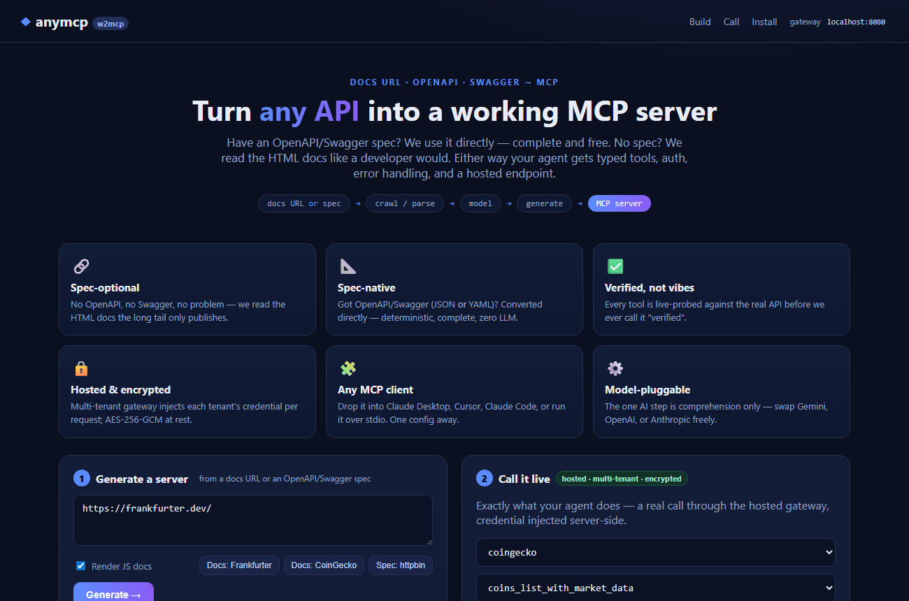

<!-- Slide 1 — Title -->
# w2mcp

## Any API's docs URL → a working MCP server. No spec required.

<br>

<span class="big">Every competitor needs a <code>swagger.json</code>.<br>We only need a <strong>URL</strong>.</span>

<br>

<span class="muted">Kartik · Demo · July 2026</span>

---

<!-- Slide 2 — The pain -->
# Your AI agent hits a wall

Your agent needs to use **API X** — a payments provider, a data vendor, an internal service.

But there's **no MCP server**. And **no OpenAPI spec**. Just **HTML docs**.

<br>

Today that means: a developer reads the docs by hand, writes a wrapper, tests it, maintains it.

## **~1 week of engineering. Per API.**

<span class="muted">Every spec-based generator on the market stops right here — no spec, no server.</span>

---

<!-- Slide 3 — The insight / market -->
# The long tail is enormous — and unreachable

The APIs with official MCP servers or clean OpenAPI specs are a **tiny minority**.

The other **thousands** publish only human-facing HTML docs:

- Regional **fintech** (India · UAE · SEA · LATAM)
- Niche **vertical SaaS**
- **Internal enterprise** APIs — never a public spec, ever

<br>

## w2mcp is the only tool that can turn *those* into agent-ready servers.

---

<!-- Slide 4 — LIVE DEMO -->
# Live: a URL becomes a server

<span class="big">Watch.</span>

<br>

1. Paste **CoinGecko's docs URL** — no spec, HTML only
2. `crawl → clean → extract → generate` (streams live in the browser)
3. A runnable **MCP server** — typed tools, auth, error handling
4. **Call it live** through the hosted gateway → real BTC/ETH prices

<br>

<span class="muted">→ switch to the product at localhost:5173, then Claude Desktop</span>

---

<!-- Slide 4b — product screenshot -->
# This is what the user sees



---

<!-- Slide 5 — How it works -->
# How it works

```
URL(s) ─▶ crawl ─▶ clean ─▶ extract ─▶ generate ─▶ MCP server
        (Playwright) (HTML→md) (LLM reads   (typed tools, auth,
                                docs→model)   shaping, errors)
```

**5 of 6 stages are deterministic.** The LLM only does *comprehension* — docs → a structured API model.

That makes the engine **model-pluggable** (Anthropic · Gemini · OpenAI) and provider-agnostic.

**Have an OpenAPI/Swagger spec?** We skip the LLM entirely and convert it directly — complete & free.
We're a **superset**: spec-optional, not spec-required.

<span class="muted">No lock-in to one model vendor. Spec when you have it, docs when you don't.</span>

---

<!-- Slide 6 — Verified, not vibes -->
# Verified, not vibes

Generated tools can hallucinate endpoints. We refuse to call anything "verified" without a **real call**.

Three honest statuses on every server:

- ✅ **live-verified** — endpoint actually called, returned 2xx + real data
- ⚠️ **unverified-write** — write endpoint, flagged, checked against the doc example
- ○ **structurally-checked** — a guardrail, never claimed as proof

<br>

## Trust is the product. This is the start of the moat.

---

<!-- Slide 7 — Hosted & secure (enterprise) -->
# Hosted, multi-tenant, secure

- Each API server runs as an **isolated subprocess** — a bad server can't crash the fleet
- Customers authenticate with an **w2mcp key**; we inject **their** downstream credential **per request**
- Credentials **encrypted at rest** (AES-256-GCM) — never in the generated code, never on screen

<br>

## Point us at your *internal* API docs behind the firewall → MCP servers for your whole stack.

<span class="muted">This is the enterprise wedge: internal APIs never have specs, and switching costs are real.</span>

---

<!-- Slide 8 — The moat -->
# The moat (what makes this un-clonable)

"URL-only" is the **wedge**. The **moat** is three compounding assets:

1. **Self-healing** — docs change, servers break; we monitor + auto-repair. *"Servers that stay working."*
2. **Verified** — a growing library of tested-green servers buyers can trust on day one.
3. **The registry** — the one directory with the long tail. More servers → more users → more feedback → better extraction. **A data + distribution flywheel.**

<br>

## The generator gets the first 100 servers. The registry + self-healing keep everyone else out.

---

<!-- Slide 9 — Market & business -->
# Market & model

**Markets:** US · UAE · Europe · India — the long-tail + internal-enterprise wedge is global.

**Land → expand:**
- *Land:* generate a server (self-serve, low friction)
- *Expand:* **hosting + monitoring + auto-healing + verification** — the recurring revenue *and* the moat, in one SKU

<br>

<span class="muted">Don't fight Salesforce / ServiceNow / Xero (already have official MCP). Own everything they'll never build.</span>

---

<!-- Slide 10 — Ask -->
# The ask

**What we have:** working engine · live-verified servers · hosted multi-tenant gateway · proven end-to-end.

**Next 90 days:** self-healing loop · public registry v1 · first 10 design-partner APIs.

<br>

## Enterprise buyers → let's connect your internal APIs.
## Investors → let's talk about owning the long tail of agent-ready APIs.

<br>

**Kartik · 360-pm-team@awign.com**
